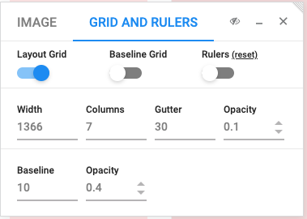

# Project Summary
---
The goal of this final project is to show you know how to use all the skills you've learned in the previous
lessons and projects.

This repository contains a single image file and some assets you'll need to complete this project.
Your objective is to create a webpage that is as near pixel-perfect, in reference to that image file,
as possible.

To assist you with creating a pixel perfect design, we suggest using the [PixelParallel](https://chrome.google.com/webstore/detail/pixelparallel-by-htmlburg/iffnoibnepbcloaaagchjonfp)
chrome extension.

We will provide you with some settings that will give you a clue to the dimensions of the webpage.

### Design Dimensions
---
To constrain the design space you will only need to create your page for the following viewport.

Viewport: **1366x768**

Some helpful settings for your PixelParallel extension are in the image below. This will give an idea
of what the margins and padding dimensions are close to.

You can then overlay the reference image using PixelParallel and start building.

### Grading
---
Your submission will be graded based on how closely it matches the reference image. The comparison
will be made by running it through an image comparison program.
